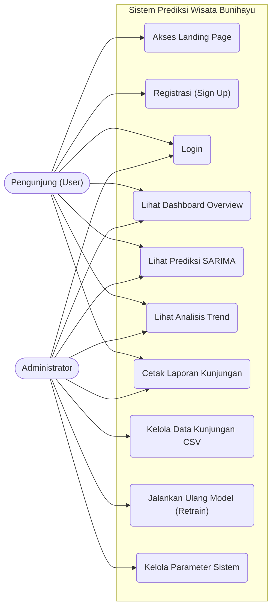
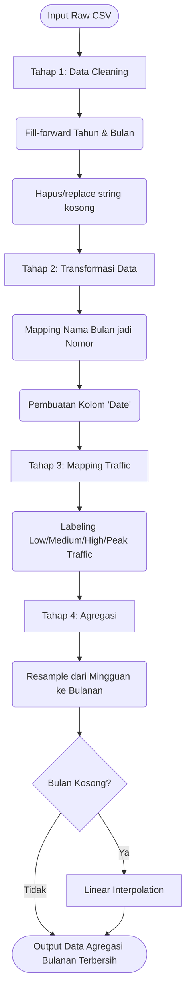

# Dokumentasi UML - Sistem Prediksi Kunjungan Wisata Bunihayu

Dokumen ini berisi pemodelan sistem menggunakan bahasa Mermaid untuk Use Case Diagram dan Activity Diagram, sesuai dengan requirement proyek.

## 1. Use Case Diagram

Diagram Use Case menggambarkan interaksi antara aktor (User dan Admin) dengan sistem aplikasi web Laravel.



## 2. Activity Diagram (Alur Proses Prediksi SARIMA)

Activity Diagram di bawah ini menggambarkan alur dari saat data historis dimasukkan, diproses oleh Machine Learning, hingga divisualisasikan oleh Website.

```mermaid
flowchart TD
    Start((Mulai)) --> A[Admin login ke sistem]
    A --> B[Admin memasukkan/update Data Kunjungan]
    B --> C{Picu proses Retrain?}
    
    C -- Ya --> D[Flask API: Menjalankan Preprocessing]
    D --> E[Flask API: Data Cleaning & Transformasi]
    E --> F[Flask API: Agregasi Mingguan ke Bulanan]
    F --> G[Flask API: Stationarity Test (ADF)]
    G --> H[Flask API: Parameter Selection (Auto ARIMA)]
    H --> I[Flask API: Training SARIMA Model]
    I --> J[Flask API: Evaluasi Metrik & Generate Forecast]
    J --> K[Flask API: Export JSON/Model]
    
    C -- Tidak --> L[User login ke Dashboard]
    K --> L
    
    L --> M[Laravel mengirim GET Request ke Flask API]
    M --> N[Flask API merespon dengan Time-Series JSON]
    N --> O[Laravel merender Dashboard View]
    O --> P[Chart.js memvisualisasikan Grafik Trend Historis vs Prediksi]
    P --> Q[User memahami estimasi lonjakan/penurunan traffic]
    Q --> End((Selesai))
```

## 3. Flowchart Preprocessing Python

Berikut adalah alur logika khusus di sisi Machine Learning Pipeline.


